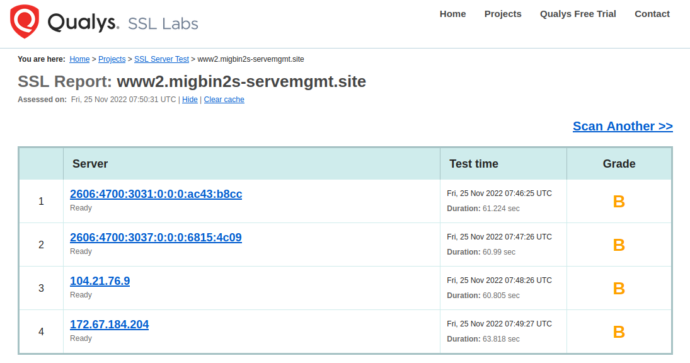

# Internship Sheet 5 - Reverse Proxy

### In this task sheet, we will create an IPv6 reverse proxy for on-premises IPv6 services. If you have not already done so, give your URL to a CDN provider for administration, who will offer access via https as an additional CDN service if required. (One possible CDN provider with a free basic plan is Cloudflare ).

## Task 1 - Nginx
### (1b) Question : Why is it useful in many cases to block access to the web server using an IP address?
* Secure websites use certificates for verification and the certificates are primarily associated with domain names not just IP address.

* And at any given time, the website can be hosted under a new/different provider with another IP address anywhere in the world.
  
* In practice most web servers are usually accessed via a proxy/loadbalancer for security and efficient traffic distribution. Hence accessing the server directly with its IP address defeats this objective.
.
### (1b)Provide your docker compose file and configuration file /etc/nginx/nginx.conf. Explain both files in detail.

```
services:
  reverse-proxy:
    container_name: reverse-proxy
    ports:
      - 80:80
    image: nginx:latest
    volumes:  # I made use of the default path for nginx and I used bind mount with exact reference to my present docker-compose-5.1.yml directory
      - ./nginx/nginx.conf:/etc/nginx/nginx.conf:ro   # ro here defines read only
      - ./nginx/ssl:/etc/nginx/ssl
      - ./nginx/websites:/usr/share/nginx/html
    networks:
      my_ipv6:
        ipv6_address: 2001:638:408:200:ff6c:cafe::7777
      loc_ipv6:

    restart: unless-stopped

networks:    # both networks were already created externally
  my_ipv6:
    name: my_ipv6
    external: true
  loc_ipv6:
    name: loc_ipv6
    external: true

```

#

```
events { }


http {
  include /etc/nginx/mime.types; # media type/content type defining all content that can be displayed
  sendfile on;

   server {
        listen 80;       # listening on port 80 for all IPv4 address
        listen [::]:80;  # listening on port 80 for all IPv6 address

        server_name "";  # implies all other server name not defined 

      location / {
          root /usr/share/nginx/html;
          index undefined.html;
      }

    }


  server {
    listen 80;    
    listen [::]:80;  

    server_name migbin2s-servemgmt.site  www.migbin2s-servemgmt.site;

# since no location modifier is given, the location definition is treated as a prefix to the URI
    location / {
      root /usr/share/nginx/html;
      index index.html;
    }
  }


}

```

### (1d) Start and test your server.

My solution:

http://www.migbin2s-servemgmt.site

http://[2001:638:408:200:ff6c:cafe:0:7777]

## Task 2 - HTTPS server
### (2a) Activate the CDN proxy functions for your server with the URL www.yourDomain.xy so that your server can be reached with http. Which IPv6 address is now used to reach your server from outside via www.yourDomain.xy?
Cloudflares' IPv6 address due to the proxy.

### (2b) Set up the CDN proxy to support access to your Nginx server with both http(= unsecured) and with https.

### (2c) How do you rate the security of your https web server?
* Though HTTPS guarantees that communication is private and encrypted, the trustworthiness of the CA should also be put into consideration. Specific level of trust even for a CA is still relative hence there could still be various risk if for example there is an internal compromise in the CA.

In general, top 10 security vulnerabilities as defined by the Open Web Security Project (OWASP) are:
* SQL Injection
* Cross Site Scripting
* Broken Authentication and Session Management
* Insecure Direct Object References
* Cross Site Request Forgery
* Security Misconfiguration
* Insecure Cryptographic Storage
* Failure to restrict URL Access
* Insufficient Transport Layer Protection
* Unvalidated Redirects and Forwards

My solution:

http://www.migbin2s-servemgmt.site (access with http via CDN proxy function)

https://www.migbin2s-servemgmt.site (access with https via CDN proxy function)


## Task 3 - reverse proxy
### (3a) Create a Docker compose file that  starts two miniwhoami services miniwhoami-loc1 and miniwhoami-loc2 on the network loc_ipv6. Now set up your web server as a reverse proxy for these two miniwhoami services. Identify the configuration file you are using /etc/nginx/nginx.conf and explain this file in detail.
```
# ------------------- NOTE: please see the complete configuration in the file prak/pr05/nginx.conf

server{
#  listening on port 80 and 443 for all IPv4 and IPv6 address
    listen 80;
    listen [::]:80;
    listen 443 ssl;
    listen [::]:443 ssl;
    ssl on;
# path to SSL/TLS certificate obtained from my CA (Cloudflare)
    ssl_certificate /etc/nginx/ssl/migbin2s-servemgmt.pem;
    ssl_certificate_key /etc/nginx/ssl/migbin2s-servemgmt.key;

    server_name miniwhoami-loc1.migbin2s-servemgmt.site;

# traffic for the '/' location is sent with the proxy_pass directive to the http resource defined (i.e http://miniwhoami-loc1 in this case) 
    location / {
        proxy_pass http://miniwhoami-loc1;
    }
}


server{

    listen 80;
    listen [::]:80;
    listen 443 ssl;
    listen [::]:443 ssl;
    ssl on;
    ssl_certificate /etc/nginx/ssl/migbin2s-servemgmt.pem;
    ssl_certificate_key /etc/nginx/ssl/migbin2s-servemgmt.key;

    server_name miniwhoami-loc2.migbin2s-servemgmt.site;

    location / {
        proxy_pass http://miniwhoami-loc2;
    }

}


```


### (3d) Run the http echo service echo on your server serv-ws22 behind your reverse proxy, so your echo can invoke the service through the reverse proxy in the following way:
## http://echo.yourDomain.xy  or
## https://echo.yourDomain.xy.

`docker run --restart unless-stopped -d --network loc_ipv6 --name=echo ealen/echo-server`

My solution :

http://miniwhoami-loc1.migbin2s-servemgmt.site

http://miniwhoami-loc2.migbin2s-servemgmt.site

http://echo.migbin2s-servemgmt.site

https://echo.migbin2s-servemgmt.site


## Task 4 - HTTPS redirection
### 4c.) How do you rate the security of your web server www2.yourDomain.xy?
* I used a Cloudflare origin CA certificate to enable full end-to-end encryption.Though HTTPS guarantees that communication is private and encrypted, the trustworthiness of the CA should also be put into consideration. Specific level of trust even for a CA is still relative hence there could still be various risk if for example there is an internal compromise in the CA.

### 4d,) Analyze the TLS security of the access for your https web server  www2.yourDomain.xy with a suitable analysis tool.
## Questions:
### Which tool did you use?
### What result did you get? What TLS versions are supported? Which TLS versions are not supported?
* I used SSL Server test on https://www.ssllabs.com/ssltest/ . It is a free online service that performs a deep analysis of the configuration of any SSL web server on the public Internet.
* TLS v1.2 and TLS v1.3 are supported.
* The result I obtained is shown below. 
#


#

My solution for part b) of the task:

http://www2.migbin2s-servemgmt.site

