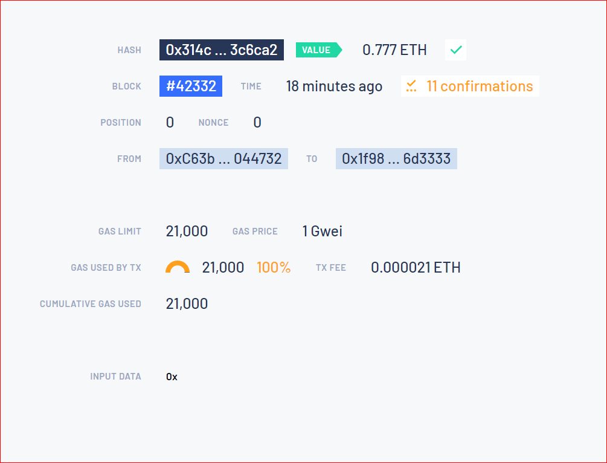

# Internship Sheet 10 - Ethereum

## Task 1 - Ethereum addresses
### (1a) How are Ethereum addresses formed? Describe the formation of an Ethereum address step by step.
* A random private key is created (64 (hex) characters / 32 bytes)
* The public key is derived from the private key  using the Elliptic Curve     Digital Signature Algorithm.
* The address is then formed from the public key by taking the last 20 bytes of the Keccak-256 hash of the public key and adding 0x as a prefix.
Reference: [ethereum.stackexchange.com](https://ethereum.stackexchange.com/questions/3542/how-are-ethereum-addresses-generated)
### (1b) What is the relationship between the hash algorithms SHA256 and Keccak?
* SHA-256 and Keccak are both cryptographic hash functions designed to be secure, fast, and efficient.
* Keccak-256, a cryptographic function, is part of Solidity (SHA-3 Family) while SHA-256 is the implementation of the SHA-2 standard with a 256 bits key.
* Ethereum uses Keccak-256 in a consensus engine called Ethash.
* The Bitcoin blockchain makes extensive use of SHA-256, including when identifying transaction hashes and when miners are performing proof-of-work mining.
* Another key difference between SHA-256 and Keccak is the size of the hash output: SHA-256 produces a 256-bit hash, while Keccak can produce hashes of various lengths, including 224, 256, 384, and 512 bits.

[Reference: geeksforgeeks.org](https://www.geeksforgeeks.org/difference-between-sha-256-and-keccak-256/)
### (1c) What is an Ethereum Black Hole Address?
* An Ethereum black hole address is a special address on the Ethereum blockchain that is associated with a contract that has no code and therefore cannot execute any actions. Transactions sent to a black hole address are effectively lost, as they cannot be retrieved or used in any way.
* The concept of a black hole address was introduced as part of the Ethereum network's upgrade to Ethereum 2.0, which included a feature called "account abstraction." Account abstraction allows for the creation of smart contracts that are associated with addresses, but do not contain any code. This can be useful in certain situations, such as when creating a contract that serves as a placeholder for a future contract that has not yet been developed.
### (1d) What is the clever idea behind the Ethereum Improvement Proposal 55 ([EIP-55: Mixed-case checksum address encoding](https://eips.ethereum.org/EIPS/eip-55) )?
* The main idea behind EIP 55 is to reduce the likelihood of users sending transactions to the wrong Ethereum address due to human error.

* EIP 55 introduces a checksum mechanism for Ethereum addresses.

* The EIP 55 algorithm transforms the original address in a number of ways to produce a checksummed address. This entails changing the address to all uppercase letters and adding a checksum as suffix.

* The address checksum approach ensures that a given address is legitimate and belongs to the intended recipient. It functions by adding an additional level of address validation, making sure that the  address is entered or copied accurately. The checksum is created by appending the first four bytes of the address's Keccak-256 hash to the end of the address in hexadecimal format.

### (1e) With the [ETH vanity address generator](https://vanity-eth.tk/) you can generate Ethereum vanity addresses - i.e. easily identifiable addresses. Behind each address there is an Ethereum account consisting of (secret key, public key, Ethereum address).
### Create an Ethereum vanity address for yourself ETH-matr , the last 5 characters of which are the last 5 digits of your (confidential) matriculation number.
### Create a second Ethereum vanity address for yourself ETH-pub, the last characters of which you like (and everyone is allowed to know).
* Comment : My address ETH-pub is:  `0xf7C15b05235f6F814a2F520c0102923B73777777`
* Comment : My address ETH-matr is: `0xC63b13eb2F087fC06EDd7e3c0610586BF4044732`

## Task 2 - Ethereum Wallet
### (2a) Decide on an Ethereum wallet and install it on your computer or on your mobile phone. Write down your account seed phrase and keep it safe.
I used Metamask as my Ethereum wallet.
### (2b) With the installation of your wallet you will receive a default account. What is this? Should this be kept secret? What are the risks of disclosing your Ethereum account?
* My wallet address for the default account is: `0xD28B572ccEf0f91Ff451ac961364467E540e044E`
* A default account is typically provided when an Ethereum wallet is installed. An account on the Ethereum network has a wallet address and an associated private key which should be kept as a secret.
* My wallet address for a given account can be shared safely with anyone from whom I want to receive fund. 
* Though it is technically safe to share my wallet address with others, it may leave me as a target.
### (2c) Connect to the Netlab Ethereum blockchain, which is only reachable over IPv6 for security reasons.The connection details for the Netlab Ethereum blockchain are:
| Network name:     | Netlab Ethereum Blockchain            | 	
|:-----------------:|:-------------------------------------:|
|RPC URL:           |http://blockchain-ipv6.docklab.de:8545 |
|ChainID:           |1111                                   | 
|Currency symbols   |N$                                     |

### (2d.i) With your wallet you can create new accounts and import accounts. What is the logical difference between the two operations?
* In creating a new account, it is necessary to generate a new wallet address and the associated private key
* But importing account means using already existing wallet address and the associated private key to access the already existing account
### (2d.ii) What exactly happens when creating and importing an account?
---- When creating an Ethereum account, the following process occurs:
* A new wallet address is generated.
* A new private key is generated.
* The private key is encrypted using your specified password.
* The encrypted private key is stored locally on your device.
* The wallet address and encrypted private key are used to create the new Ethereum account.
  
---- When importing an Ethereum account, the following process occurs:
* In the case of 'Metamask', you enter the private key for the existing account into your Ethereum wallet  software.
* the private key is encrypted using your specified password.
* The encrypted private key and the wallet address for the account are used to access the existing Ethereum account.
  
## Task 3 - Ethereum Faucet`
### You can transfer Netlab dollars (N$) to any Ethereum account via the Netlab Faucet [( http://faucet.docklab.de:8080/ )](http://faucet.docklab.de:8080/).
### (3a) Cash out some N$ to your wallet default account.
### (3b) Identify this transaction in the Ethereum Lite Explorer:  [http://explorer.docklab.de:25000/](http://explorer.docklab.de:25000/) or in Blockscout:  [http://blockscout.docklab.de:4000/](http://blockscout.docklab.de:4000/) and write down the transaction number.
* block: #42152
* Transaction hash: `0x35e928a8924f72c827d30a16986f7a33e5d312d61e40313b4e7c4ce87653ecca`

### (3c) What is the Ethereum address of the Netlab faucet?
`0xB25F98E8190DaaA442Cd865f3Bfc8187C9CEaffe`

## Task 4 - Ethereum Transaction
### (4a) Transfer a small N$ amount from your wallet default account to your ETH-pub account or to a fellow student's ETH-pub account.
### (4b) Identify this transaction in the Ethereum Lite Explorer:  [http://explorer.docklab.de:25000/](http://explorer.docklab.de:25000/) or in Blockscout:  [http://blockscout.docklab.de:4000/](http://blockscout.docklab.de:4000/) (unfortunately no longer stable) and note down the transaction number.
* block: #42302
* Transaction hash: `0x7facfb23497db05feabca8189b7e7edd115b569ccc53b021a6c6456ce800e4be`

### (4c) Using the Ethereum Lite Explorer, analyze the transaction `29398`. What "forensic" results can you derive from your analysis? How do you rate the anonymity of a bitcoin payment against the background of the money laundering problem?

### (4d) Important note, important task: 
### On Thursday, 2 February, the exam "Service Management in Networks" will take place from 13:00 to 14:30. Please transfer the exam fee of N$ 0.777 from your ETH-matr account to the Netlab Ethereum Blockchain account 0x1f9883a5FD4e9cCa3f49BB6023E6bE0f8a6d3333 by 23:55 on Wednesday, 21.12.22 at the latest.

